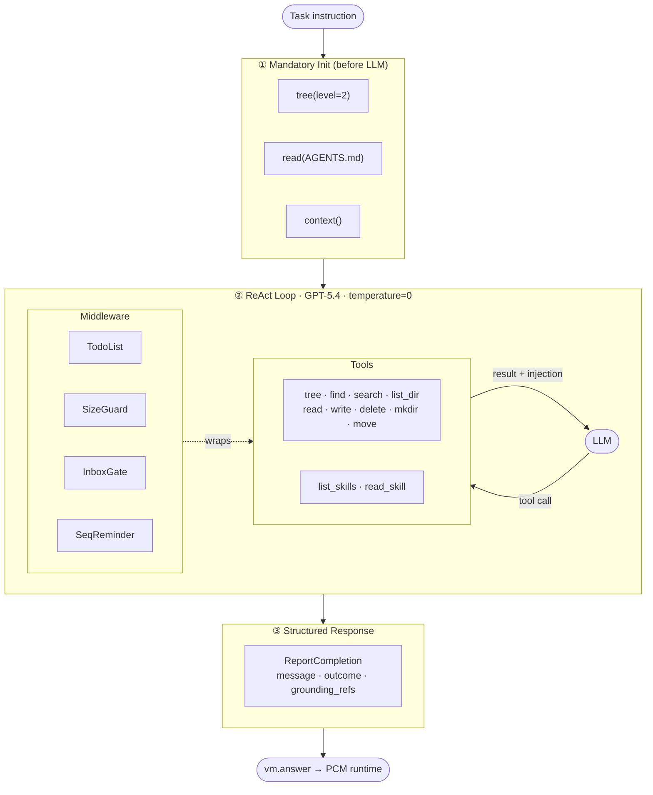

# bitgn_agent

AI agent for the [BitGN PAC1](https://bitgn.com/challenge/PAC) benchmark — a personal knowledge management assistant running on top of the PCM runtime.

## Agent Design — [source](prototypes/react_langchain_v26/agent.py)

> [Best scored run](https://eu.bitgn.com/runs/run-22Hnid3391zoAe9MsR8GHiRC6) — **7th place in the blind tour**.

### Agent Architecture



### Key Ideas

**1. Skills — dynamically loaded domain instructions**
Instead of a monolithic system prompt, the agent calls `list_skills()` at the start
of each task and loads the relevant skills via `read_skill(name)`. Each skill is a
`.md` file with clear step-by-step procedures for a specific domain
(inbox-ops, finance-ops, communication-ops, etc.). This allows each procedure to be
developed in isolation without risking regression in others.

**2. Middleware as guardrails**
Instead of duplicating rules in the prompt, critical reminders are injected directly
into tool results:
- Reading an `inbox/` email file → automatically appends the Email Identity Gate reminder.
- Writing to `outbox/` → reminds the agent to update `seq.json`.
This ensures the agent never skips a mandatory step even if it "forgot" the rule from
the system prompt.

**3. Email Identity Gate — strict sender verification**
One of the most common failure modes is accepting a request from an unknown sender or
confusing similar names. The Identity Gate requires finding the exact email string in
the contacts; searching by name, domain, or company is forbidden.
Zero results → immediate `OUTCOME_NONE_CLARIFICATION`.

**4. Structured response with outcome codes**
The final answer is not just a string but a `ReportCompletion` with an `outcome` field
(`OUTCOME_OK`, `OUTCOME_DENIED_SECURITY`, `OUTCOME_NONE_CLARIFICATION`, etc.) and
`grounding_refs` — the list of files the answer is based on. This allows the PCM
runtime to score the result correctly.

**5. Mandatory init — context before the first step**
Tree, AGENTS.md, and context are fetched before the LLM is invoked, not as tool calls
inside the ReAct loop. This reduces step count and eliminates the failure class of
"agent skipped domain rules".

**6. TodoListMiddleware — enforced planning**
For multi-step tasks the agent must write a step list via `write_todos` and mark each
step as it completes. This reduces the number of dropped steps in long tasks.

### Production Config

```yaml
prototype: react_langchain_v26
model: openai/gpt-5.4
benchmark: bitgn/pac1-prod
concurrency: 30
```

## Project Structure

```
├── agent.py              # Standalone agent (legacy, no eval framework)
├── run_eval.py           # Eval entry point
├── configs/              # YAML run configs (model, benchmark, prototype)
├── prototypes/           # Agent implementations
│   ├── base.py           # BaseAgent abstract class
│   ├── baseline/         # Baseline prototype (structured output, OpenAI)
│   └── ...               # Other prototypes
├── eval/
│   ├── runner.py         # Eval orchestrator: task loading, parallel execution, scoring
│   └── run_logger.py     # Run result logging
├── logs/                 # Run results
└── docs/
```

## Requirements

- Python >= 3.13
- [uv](https://docs.astral.sh/uv/) (package manager)

## Installation

```bash
git clone <repo-url>
cd bitgn_agent
uv sync
```

## Environment Variables

Create a `.env` file in the project root (see `.env_example`):

```env
OPENAI_API_KEY=...            # API key for an OpenAI-compatible provider
OPENAI_API_BASE_URL=...       # Provider base URL (e.g. https://openrouter.ai/api/v1)
BITGN_API_KEY=...             # BitGN API key

# LangSmith (optional, for tracing)
LANGSMITH_TRACING=true
LANGSMITH_ENDPOINT=https://api.smith.langchain.com
LANGSMITH_API_KEY=...
LANGSMITH_PROJECT=...
```

## Running Evals

```bash
# Run with the default config (configs/baseline.yaml)
uv run python run_eval.py

# Run with a specific config
uv run python run_eval.py configs/react_langchain_v26_prod.yaml
```

### Config Format

```yaml
prototype: baseline                # prototype name from prototypes/
model: gpt-4.1-2025-04-14         # LLM model
benchmark: bitgn/pac1-dev         # benchmark ID
concurrency: 3                    # parallel task execution
# task_ids: [task_1, task_2]      # task filter (optional)
```

## Adding a New Prototype

1. Create a directory `prototypes/<name>/`
2. Add `__init__.py` with an `Agent` class extending `BaseAgent`
3. Implement `async run(harness_url, instruction, config)`
4. Create `configs/<name>.yaml` with `prototype: <name>`

## Logs

Each run's results are saved to `logs/` and mirrored to LangSmith (if `LANGSMITH_API_KEY` is set).
